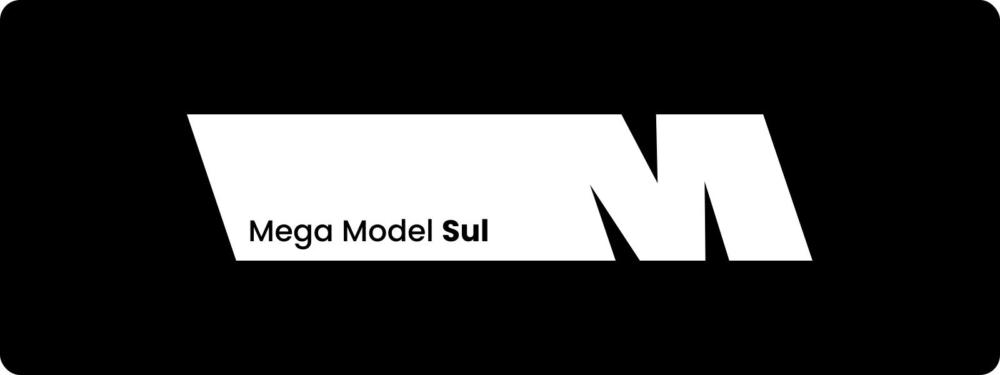

# Mega Model Sul

A Mega Model é a maior agência de talentos da américa latina. Com mais de 20 anos de estrada, é o ponto de partida de diversas celebridades. Com plataforma própria de gerenciamento, onboarding e painel do agenciado, a Mega se destaca pela qualidade do seu trabalho, contatos e pioneirismo no ramo.

Repositórios privados para a organização **Mega Model Sul**.

Responsável técnico: [Rafhael Marsigli](https://github.com/rmarsigli)

## Plataformas Públicas

- [Mega Model Sul](https://megamodelsul.com.br)
- [Vitrine Mega Model](https://vitrinemegamodel.com.br)
- [Sou Mega Model](https://soumegamodel.com.br)
- [Sou Mega Kids](https://soumegakids.com.br)
- [Sou Mega Diversity](https://soumegadiversity.com.br)
- [Mega Experience](https://megaexperience.com.br)
- [Seletiva Mega Model](https://seletivamegamodel.com.br)

> Plataformas internas de gestão não são listadas publicamente.

## Padrões de Desenvolvimento

### Linguagens e Tecnologias

- **Backend**: Laravel
- **Frontend**: React, TypeScript, Astro
- **Banco de Dados**: PostgreSQL
- **DevOps**: Docker, CI/CD

### Práticas de Código

- Code Review obrigatório
- Testes automatizados
- Linting e formatação automática
- Versionamento semântico
- Tipagem estrita

### Segurança

- Criptografia de dados sensíveis
- Auditorias de segurança regulares

### Documentação

- Documentação de API em OpenAPI/Swagger
- README em cada repositório
- Changelogs atualizados
